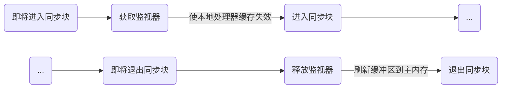

### 什么是内存模型（JMM）

> Java内存模型描述了<u>**在多线程代码中哪些行为是合法的**</u>，以及**<u>线程如何通过内存进行交互</u>**。它**<u>描述了“程序中的变量“ 和 ”从内存或者寄存器获取或存储它们的底层细节”之间的关系</u>**。Java内存模型通过使用各种各样的硬件和编译器的优化来正确实现以上事情。
>
> Java包含了几个语言级别的关键字，包括：volatile, final以及synchronized，目的是为了帮助程序员向编译器描述一个程序的并发需求。Java内存模型定义了volatile和synchronized的行为，更重要的是保证了同步的java程序在所有的处理器架构下面都能正确的运行。

JMM主要关心的是在多线程环境下，Java线程与内存交互细节。

Java语言通过`volatile`,` final`以及`synchronize`关键字来规范代码在多线程环境下的行为，使得在多线程环境下的代码能按照预计的计划执行。在JMM中定义了这三个关键字的行为，保证了不同处理器架构下语义的正确。

在下面的代码中，在多线程环境下会看到不同的值

```java
ClassReordering {

    int x = 0, y = 0;

    public void writer() {

        x = 1;

        y = 2;

    }

    public void reader() {

        int r1 = y;

        int r2 = x;

    }

}
```

### 其他语言，像C++，也有内存模型吗？

很多语言对于多线程没有统一标准，多线程的行为的准确性依赖于线程库、编译器、代码平台等外部环境。

C++11 定义了其内存模型。

### JSR133是什么

为了修复了早期Java内存模型中的某些缺陷，JSR133为Java语言定义了一个新的内存模型，并提供了<u>**volatile、synchronzied和final如何工作**</u>的直观框架。

> JSR 133的目标包含了：
>
> - 保留已经存在的安全保证（像类型安全）以及强化其他的安全保证。例如，变量值不能凭空创建：线程观察到的每个变量的值必须是被其他线程合理的设置的。
>
> - 正确同步的程序的语义应该尽量简单和直观。
>
> - 应该定义未完成或者未正确同步的程序的语义，主要是为了把潜在的安全危害降到最低。
>
> - 程序员应该能够自信的推断多线程程序如何同内存进行交互的。
>
> - 能够在现在许多流行的硬件架构中设计正确以及高性能的JVM实现。
>
> - 应该能提供 *安全地初始化*的保证。如果一个对象正确的构建了（意思是它的引用没有在构建的时候逸出，那么所有能够看到这个对象的引用的线程，在不进行同步的情况下，也将能看到在构造方法中中设置的final字段的值。
>
> - 应该尽量不影响现有的代码。

### 重排序意味着什么？

> 在很多情况下，访问一个程序变量（对象实例字段，类静态字段和数组元素）可能会使用不同的顺序执行，而不是程序语义所指定的顺序执行。编译器能够自由的以优化的名义去改变指令顺序。在特定的环境下，处理器可能会次序颠倒的执行指令。数据可能在寄存器，处理器缓冲区和主内存中以不同的次序移动，而不是按照程序指定的顺序。
>
> 例如，如果一个线程写入值到字段a，然后写入值到字段b，而且b的值不依赖于a的值，那么，处理器就能够自由的调整它们的执行顺序，而且缓冲区能够在a之前刷新b的值到主内存。有许多潜在的重排序的来源，例如编译器，JIT以及缓冲区。
>
> 编译器，运行时和硬件被期望一起协力创建好像是顺序执行的语义的假象，这意味着在单线程的程序中，程序应该是不能够观察到重排序的影响的。但是，重排序在没有正确同步了的多线程程序中开始起作用，在这些多线程程序中，一个线程能够观察到其他线程的影响，也可能检测到其他线程将会以一种不同于程序语义所规定的执行顺序来访问变量。
>
> 大部分情况下，一个线程不会关注其他线程正在做什么，但是当它需要关注的时候，这时候就需要同步了。

在很多情况下，访问一个程序变量可能会使用不同的顺序执行。为了优化性能，编译器可能改变指令的顺序；处理器也可能改变指令的执行顺序。数据在在寄存器，处理器缓冲区和主内存中移动的顺序可能跟程序指定的顺序不同。

虽然指令执行的顺序被重新排列了，但是编译器、运行时硬件共同保证了，程序按照顺序执行的假象。在单线程程序中确实如此，但在多线程程序中，一个线程能观察到其他线程以不同与程序指定的顺序访问变量。

这里的重排序，仅仅指代**``访问一个程序变量``**

### 旧的内存模型有什么问题？

> 例如，一个被广泛认可的概念就是，如果使用final字段，那么就没有必要在多个线程中使用同步来保证其他线程能够看到这个字段的值。尽管这是一个合理的假设和明显的行为，也是我们所期待的结果。实际上，在旧的内存模型中，我们想让程序正确运行起来却是不行的。在旧的内存模型中，final字段并没有同其他字段进行区别对待——这意味着同步是保证所有线程看到一个在构造方法中初始化的final字段的唯一方法。结果——如果没有正确同步的话，对一个线程来说，它可能看到一个字段的默认值，然后在稍后的时间里，又能够看到构造方法中设置的值。这意味着，一些不可变的对象，例如String，能够改变它们值——这实在很让人郁闷。

一般认为，如果使用final字段，在不同的线程中看到某线程的该字段都是一致的。但是在旧的内存模型中，其他线程可能在某线程final字段初始化前看到的是字段的默认值，初始化后看到的是另外的值，这意味着如果需要保证final字段对其他线程的可见值唯一，那么需要对final字段的初始化需要进行同步。

> 旧的内存模型允许volatile变量的写操作和非volaitle变量的读写操作一起进行重排序，这和大多数的开发人员对于volatile变量的直观感受是不一致的，因此会造成迷惑。

如果程序没有正确同步，程序员对程序执行的直观感受通常是错误的。

### 没有正确同步的含义是什么？

> 没有正确同步的代码对于不同的人来说可能会有不同的理解。在Java内存模型这个语义环境下，我们谈到“没有正确同步”，我们的意思是：
>
> 1. 一个线程中有一个对变量的写操作，
> 2. 另外一个线程对同一个变量有读操作，
> 3. 而且写操作和读操作没有通过同步来保证顺序。
>
> 当这些规则被违反的时候，我们就说在这个变量上有一个“数据竞争”(data race)。一个有数据竞争的程序就是一个没有正确同步的程序。

**Java内存模型语义**下的两种描述：

1. 不同的线程对同一变量有读和写操作且没有通过同步来保证执行顺序
2. 存在数据竞争的程序

### 同步会干些什么呢？（需要完善）

> 同步有几个方面的作用。最广为人知的就是互斥 ——一次只有一个线程能够获得一个监视器，因此，在一个监视器上面同步意味着一旦一个线程进入到监视器保护的同步块中，其他的线程都不能进入到同一个监视器保护的块中间，除非第一个线程退出了同步块。

同步的作用：互斥，一次只有一个线程能获取监视器，同步块内的代码只会被某一线程执行。

> 但是同步的含义比互斥更广。同步保证了一个线程在同步块之前或者在同步块中的一个内存写入操作以可预知的方式对其他有相同监视器的线程可见。当我们退出了同步块，我们就释放了这个监视器，这个监视器有刷新缓冲区到主内存的效果，因此该线程的写入操作能够为其他线程所见。在我们进入一个同步块之前，我们需要获取监视器，监视器有使本地处理器缓存失效的功能，因此变量会从主存重新加载，于是其它线程对共享变量的修改对当前线程来说就变得可见了。



本地处理器缓存失效：意味着其他线程缓存的共享变量失效，需要重新去主存中读取最新值

刷新缓冲区到主内存：意味着某线程修改共享变量后，其他线程能看到修改后的结果

同步的作用：同步保证了一个线程进入同步块之前的状态和离开同步块之后的状态对于其他线程来说是可见的

#### happens before 内容（待完善）

`happens before` 用来描述线程之间的内存可见性，如果一个***同步动作***对于另一个***同步动作***可见，那么这个*同步动作*应该`happens before` 另一个***同步动作***，也就是说判断一个***同步动作***是否对另一个***同步动作***可见，只需要看他们之间有没有`happens before`关系

JMM中定义了许多同步动作，以及这些动作之间的`happens before`关系

### Final字段如何改变它们的值

已如下代码为例。

```
String s1 = "/usr/tmp";
String s2 = s1.substring(4); 
```

String.substring()方法能够通过改变length和offset，而共享原始的character数组来创建一个新的String。对一个String来说，这些字段都是final型的字段。

在旧的JMM模型中，线程1在执行下面的代码时，线程2看到的offset可能一开始是默认值0，然后才是4。

### 在新的Java内存模型中，final字段是如何工作的

> 一个对象的final字段值是在它的构造方法里面设置的。假设对象被正确的构造了，一旦对象被构造，在构造方法里面设置给final字段的的值在没有同步的情况下对所有其他的线程都会可见。另外，引用这些final字段的对象或数组都将会看到final字段的最新值。
>
> 对一个对象来说，被正确的构造是什么意思呢？简单来说，它意味着这个正在构造的对象的引用在构造期间没有被允许逸出。（参见[安全构造技术](http://www.ibm.com/developerworks/java/library/j-jtp0618/index.html)）。换句话说，不要让其他线程在其他地方能够看见一个构造期间的对象引用。不要指派给一个静态字段，不要作为一个listener注册给其他对象等等。这些操作应该在构造方法之后完成，而不是构造方法中来完成。

在没有同步的情况下，final字段的值在初始化后对其他线程可见。对于类中的final字段，当对象被**正确构造**之后，类中的final字段（在没有同步的情况下）对其他线程可见。如果final字段本身是一个引用，那么他将看到其引用（对象或是数组）的最新值

正确构造：在构造期间对象的引用没有溢出

```java
class FinalFieldExample {
  final int x;
  int y;
  static FinalFieldExample f;
  public FinalFieldExample() {
    x = 3;
    y = 4;
  }

  static void writer() {
    f = new FinalFieldExample();
  }

  static void reader() {
    if (f != null) {
      int i = f.x;
      int j = f.y;
    }
  }
}
```
在上面的代码中，因为x是final字段，所以我们能保证`reader`方法`f.x`读出来的值是 3，但不能保证`f.y`读出来是4

上面的代码没有构造溢出，而下面的代码则溢出了。

```java
public FinalFieldExample() { // bad!
  x = 3;
  y = 4;
  // bad construction - allowing this to escape
  global.obj = this;
}
```

在上面的`bad construction`执行的过程中，可能发生[重排序](#重排序意味着什么？)，其他线程读global.obj时，获取的可能是一个没有初始化完全的`FinalFieldExample`对象，此时不能保证`this.x`读取出来的值是3

> 现在，在讲了如上的这段之后，如果在一个线程构造了一个不可变对象之后（对象仅包含final字段），你希望保证这个对象被其他线程正确的查看，你仍然需要使用同步才行。例如，没有其他的方式可以保证不可变对象的引用将被第二个线程看到。使用final字段的程序应该仔细的调试，这需要深入而且仔细的理解并发在你的代码中是如何被管理的。（待完善）

不可变对象如需在不同线程间正确查看仍需要使用同步。因为不可变对象的引用能被其他线程看到（构造时可能引用溢出），在构造不可变对象时需要进行同步（防止构造时的引用溢出）。

### volatile是干什么用的

> Volatile字段是用于线程间通讯的特殊字段。每次读volatile字段都会看到其它线程写入该字段的最新值；实际上，程序员之所以要定义volatile字段是因为在某些情况下由于缓存和重排序所看到的陈旧的变量值是不可接受的。编译器和运行时禁止在寄存器里面分配它们。它们还必须保证，在它们写好之后，它们被从缓冲区刷新到主存中，因此，它们立即能够对其他线程可见。相同地，在读取一个volatile字段之前，缓冲区必须失效，因为值是存在于主存中而不是本地处理器缓冲区。在重排序访问volatile变量的时候还有其他的限制。
>
> 在旧的内存模型下，访问volatile变量不能被重排序，但是，它们可能和访问非volatile变量一起被重排序。这破坏了volatile字段从一个线程到另外一个线程作为一个信号条件的手段。
>
> 在新的内存模型下，volatile变量仍然不能彼此重排序。和旧模型不同的时候，volatile周围的普通字段的也不再能够随便的重排序了。写入一个volatile字段和释放监视器有相同的内存影响，而且读取volatile字段和获取监视器也有相同的内存影响。事实上，因为新的内存模型在重排序volatile字段访问上面和其他字段（volatile或者非volatile）访问上面有了更严格的约束。当线程A写入一个volatile字段f的时候，如果线程B读取f的话 ，那么对线程A可见的任何东西都变得对线程B可见了。

volatile字段用于线程间的通信，线程每次读volatile字段时都会看到其他线程写入该字段的最新值。

旧的内存模型中，访问volatile变量不能被重排序，但是可能会和访问非volatile变量一起被重排序。

新的内存模型中，访问volatile变量仍然不能被重排序，区别在于volatile变量和周围的非volatile变量都不会被重排序

```java
class VolatileExample {
  int x = 0;
  volatile boolean v = false;
  public void writer() {
    x = 42;
    v = true;
  }

  public void reader() {
    if (v == true) {
      //uses x - guaranteed to see 42.
    }
  }
}
```

假设线程1调用写方法时，线程2调用读方法，当线程2读到`v == true`时，能够保证` x = 42`对线程2可见


### 参考

[http://ifeve.com/jmm-faq/](http://ifeve.com/jmm-faq/)

[http://ifeve.com/easy-happens-before/](http://ifeve.com/easy-happens-before/)

<https://www.infoq.cn/article/java_memory_model>

<http://www.cs.umd.edu/~pugh/java/memoryModel/jsr-133-faq.html>
